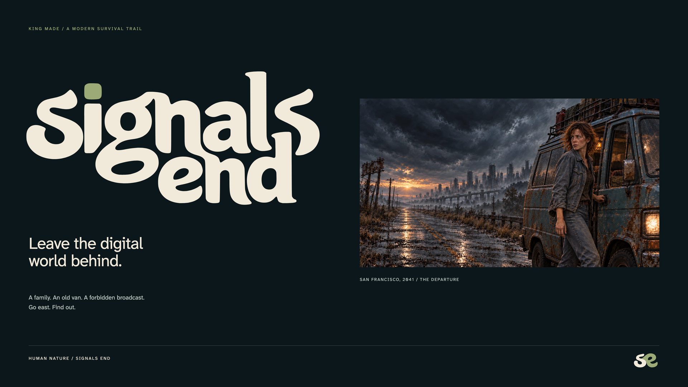
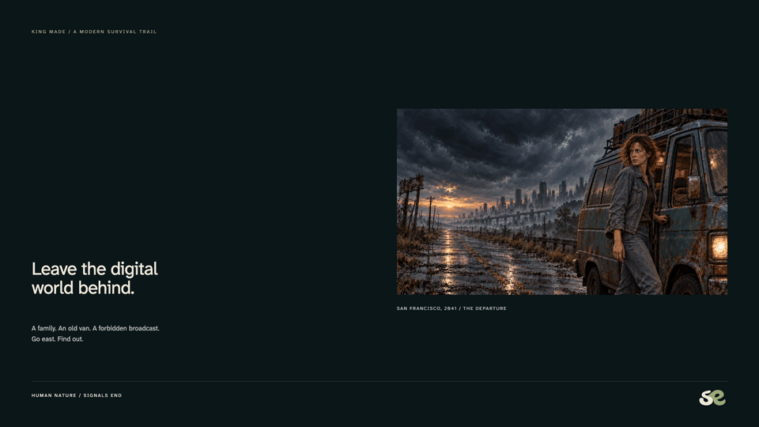

# Signals End

A family, an old van, and a forbidden broadcast. Leave San Francisco and follow a rumor toward the Ozarks in **Signals End**, an illustrated road-trip survival prototype by King Made.

**[Play the demo — v0.8.9](https://kingmadellc.github.io/common-road-demo/?v=0.8.9)** · [Opening and departure](https://kingmadellc.github.io/common-road-demo/?v=0.8.9&departure=1&film=1) · [World and brand kit](https://kingmadellc.github.io/common-road-demo/brand/)

[](https://kingmadellc.github.io/common-road-demo/?v=0.8.9)

## The journey

San Francisco, 2041. Nine mandatory apps control everyday life. A disputed employment report can close a household’s access to money, food, and housing before anyone hears an appeal. The Mercers load their van and head east toward an analog refuge that has promised them nothing.

Travel through Richmond, Truckee, Wells, Rawlins, North Platte, Kansas, and Ava. Hunt, fish, trade, scavenge, repair the van, and evade Safety’s contracted Collectors. Earn trust and fulfill an entry agreement before deciding whether to accept the refuge’s charter.

## Play

Touch is the primary input; keyboard and controller input are also implemented. The 232-second illustrated opening can be skipped and remembers viewing history. Use **SFX** in the header; Pause includes separate effects and environment levels. Reduced motion freezes scene overlays.

The v0.8.9 build clarifies the order of the radio discovery and the family’s departure. Ben receives the receiver during a parts pickup, gets it working at home, and hears the Ozark broadcast with Sarah. Jack listens the following evening. After three nights of debate, a work dispute and household lockout force them to pack and return to Bea. Both 232-second movie exports have updated scene cues across 26 illustrations and 45 caption segments. New runs that bypass the film get a brief recap; continuing journeys retain their progress. The road, journal and brand kit follow the same sequence through Frank’s authenticated reply and the refuge’s voluntary charter. The [previous demo](https://kingmadellc.github.io/common-road-demo/v06/) keeps its own save.

This is a browser concept playtest. Illustrations and local scene motion are not articulated character animation or voiced performances. Automated browser checks do not establish physical-device performance or human playtest results.

## Artwork and motion

| Asset | Format | Open |
| --- | --- | --- |
| Cover artwork | 3840 × 2160 PNG | [4K cover](brand/downloads/signals-end-cover-3840x2160.png) |
| Title reveal | 1920 × 1080 MP4 · 2.5 seconds | [Watch the title reveal](https://kingmadellc.github.io/common-road-demo/brand/downloads/signals-end-title-reveal.mp4) |
| Opening film | Landscape MP4 | [Watch](https://kingmadellc.github.io/common-road-demo/assets/opening-087/signals-end-landscape.mp4) |
| Opening film | Portrait MP4 | [Watch](https://kingmadellc.github.io/common-road-demo/assets/opening-087/signals-end-portrait.mp4) |
| Social and story artwork | 2160 × 2160 / 2160 × 3840 PNG | [Square](brand/downloads/signals-end-social-2160.png) · [Portrait](brand/downloads/signals-end-story-2160x3840.png) |

The artwork and clips are presentation assets, not recordings of player-controlled gameplay. The [brand kit](https://kingmadellc.github.io/common-road-demo/brand/) includes wordmarks, symbols, and additional exports.

<details>
<summary>Preview the title reveal in this README</summary>



[Watch the full-resolution MP4](https://kingmadellc.github.io/common-road-demo/brand/downloads/signals-end-title-reveal.mp4). The GIF is a smaller preview of the existing clip.

</details>

## Run locally

With Git and Python 3 installed:

```sh
git clone https://github.com/kingmadellc/common-road-demo.git
cd common-road-demo
python3 -m http.server 8000
```

Open **http://localhost:8000**. No package install or build step is required. Serve the repository root so versioned scripts, images, and audio resolve correctly.

| Path | Purpose |
| --- | --- |
| `index.html` | Current demo entry point |
| `v07/` | Current application scripts and styles, including v0.8 updates |
| `assets/` | Illustrations, motion, audio, and interface assets |
| `brand/` | Public brand kit and downloadable exports |
| `build-info.json` | Release metadata |
| `v06/` | Earlier demo with separate save storage |

## Credits and feedback

Created by **King Made**. Material sounds use [Kenney CC0 impact sounds](https://kenney.nl/assets/impact-sounds); additional effects are procedural. The opening uses effects only; music is to be supplied separately by the creator. This repository does not declare a general open-source license.

[Report an issue](https://github.com/kingmadellc/common-road-demo/issues) with the version, browser/device, journey location, and steps to reproduce. The repository and URL keep their earlier **Common Road** name to preserve existing links.
